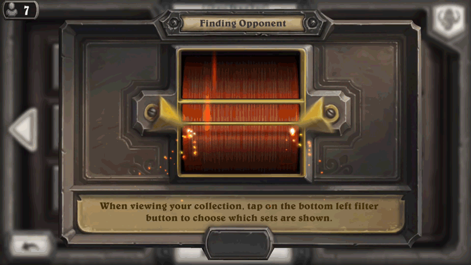

# think-progress

## What is this?

This repository contains a reimagining of progress bars in the light of 
the principles of good thinking and good map making.

This progress visualization is intended known out of known step counts with
uniform step sizes. It isn't intended to be a visualization of all types of progress, but for
progressions like those produced when reading a book. A book's 
length is known. The number of pages that have been read in that book is 
also known.

The progress visualizations produced here communicate not just the 
current amount of progress, but the whole history of progress. It uses that 
history to make educated guesses as to how progress will proceed in the 
future. So in the case of reading a book you would be able to answer 
questions like given I've been reading three pages a day I will finish the 
book in thirty days.

If that sounds a little confusing, just look at an example progress widget
and things should become clear:

```
<ThinkProgress datset={dataset}>
```


## Why

Traditional progress bars tend to look something like this:

> 

Take a moment to try to answer questions using the progress visualization 
like:

 - How much longer will it take to complete?
 - What is the recent history of progress?
 - How is progress momentum developing? It is getting faster? Slower?
 - Should I hold my breath?

If you had trouble answering those questions then it might be a bit more
clear why the current state of the art in progress visualization design
tends to celebrate not even attempting to give a means of inferring
progression.



Implicit in their failure to communicate information about progress the 
current standard for communicating progress is asking us to think about 
progress for ourselves. However, there is reason we should hesitate to do 
so.

For one, research shows that people tend to be pretty bad at estimating
how long things will take. Even our worst cast estimates tend to be 
optimistic. Moreover, this holds even when we know it is the case. Since 
we know that this is an error we make frequently and one which is little 
cured by experience we probably shouldn't be confidently producing 
wrong estimates.

For another, even giving this estimate is an act of hard work. To give a 
reasonable estimate we need to think about how progress has been, what 
is remaining, and extrapolate. This involves math. This is involves 
accounting for situations that are unrelated to the topic we are dealing 
with that may come in to distract us. It isn't just difficult to get this 
answer, but is a form of the halting problem. It is both hard to answer 
and also impossible to have a correct answer.

Theoretically, we can never guess correctly, showing the wisdom behind 
a loading visualization that doesn't even pretend to help a person think.
In practice information about when things will complete is actually valuable 
enough that people really want it. So we have to think about it anyway.

Or do we?

> It is a profoundly erroneous truism, repeated by all copybooks and
> by eminent people when they are making speeches, that we should
> cultivate the habit of thinking of what we are doing. The precise
> opposite is the case. Civilization advances by extending the number
> of important operations which can be performed without thinking about
> them.
> - Alfred North Whitehead

These progress visualizations try to take cues from lessons on good 
visualization and good thinking found in books on the topic by Edward 
Tufte. They do this with the intention of creating something which 
does good thinking on behalf of the person using it.

## Installation

## Usage

To create a dashboard which renders many progress visualizations:

```
import ThinkProgressDashboard from "./think/progress/ThinkProgressDashboard";

function App() {
  let datasets= [<your dataset>, ...];
  return (
      <ThinkProgressDashboard datasets={datasets}/>
  );
}

export default App;
```

To create a single progress visualization:

```
import ThinkProgressDashboard from "./think/progress/ThinkProgressDashboard";

function App() {
  let datasets= [<your dataset>, ...];
  return (
      <ThinkProgress dataset={dataset} selected=true />
  );
}

export default App;
```


## Available Scripts

In the project directory, you can run:

### `yarn start`

Runs the app in the development mode.\
Open [http://localhost:3000](http://localhost:3000) to view it in the browser.

The page will reload if you make edits.\
You will also see any lint errors in the console.

### `yarn test`

Launches the test runner in the interactive watch mode.\
See the section about [running tests](https://facebook.github.io/create-react-app/docs/running-tests) for more information.

### `yarn build`

Builds the app for production to the `build` folder.\
It correctly bundles React in production mode and optimizes the build for the best performance.

The build is minified and the filenames include the hashes.\
Your app is ready to be deployed!

See the section about [deployment](https://facebook.github.io/create-react-app/docs/deployment) for more information.

### `yarn eject`

**Note: this is a one-way operation. Once you `eject`, you can’t go back!**

If you aren’t satisfied with the build tool and configuration choices, you can `eject` at any time. This command will remove the single build dependency from your project.

Instead, it will copy all the configuration files and the transitive dependencies (webpack, Babel, ESLint, etc) right into your project so you have full control over them. All of the commands except `eject` will still work, but they will point to the copied scripts so you can tweak them. At this point you’re on your own.

You don’t have to ever use `eject`. The curated feature set is suitable for small and middle deployments, and you shouldn’t feel obligated to use this feature. However we understand that this tool wouldn’t be useful if you couldn’t customize it when you are ready for it.

## Learn More

You can learn more in the [Create React App documentation](https://facebook.github.io/create-react-app/docs/getting-started).

To learn React, check out the [React documentation](https://reactjs.org/).

### Code Splitting

This section has moved here: [https://facebook.github.io/create-react-app/docs/code-splitting](https://facebook.github.io/create-react-app/docs/code-splitting)

### Analyzing the Bundle Size

This section has moved here: [https://facebook.github.io/create-react-app/docs/analyzing-the-bundle-size](https://facebook.github.io/create-react-app/docs/analyzing-the-bundle-size)

### Making a Progressive Web App

This section has moved here: [https://facebook.github.io/create-react-app/docs/making-a-progressive-web-app](https://facebook.github.io/create-react-app/docs/making-a-progressive-web-app)

### Advanced Configuration

This section has moved here: [https://facebook.github.io/create-react-app/docs/advanced-configuration](https://facebook.github.io/create-react-app/docs/advanced-configuration)

### Deployment

This section has moved here: [https://facebook.github.io/create-react-app/docs/deployment](https://facebook.github.io/create-react-app/docs/deployment)

### `yarn build` fails to minify

This section has moved here: [https://facebook.github.io/create-react-app/docs/troubleshooting#npm-run-build-fails-to-minify](https://facebook.github.io/create-react-app/docs/troubleshooting#npm-run-build-fails-to-minify)
